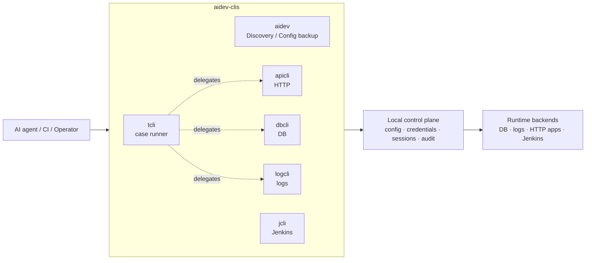
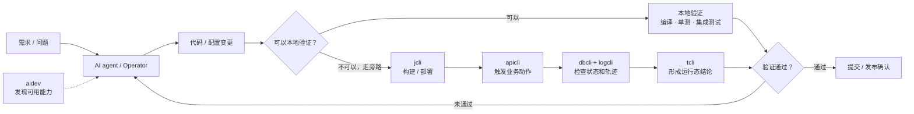

# aidev-clis

## 前言

**为无法建立本地验证闭环的老系统，补上一条旁路验证链。**

很多老系统没有可用的单元测试和集成环境，甚至无法在本地启动。一次改动是否生效，只能部署后调用真实接口，再从数据库状态和日志轨迹中寻找答案。

这条验证链原本依赖人工：在构建平台、接口工具、数据库和日志系统之间反复切换，处理凭据并复制结果。反馈慢、成本高，也让 AI 无法独立完成“修改 → 验证 → 再修改”闭环。

`aidev-clis` 将这条链路拆成一组可组合的 CLI：发现环境、构建部署、触发业务、查询数据、追踪日志，最后形成验证结论。每一步都面向 agent 提供结构化输出，从而把老系统原本缓慢的人工验证过程，变成 AI 可以持续执行的反馈闭环。

> 整个验证链的耗时不会因此消失，但执行过程不再持续占用人工，工程师可以并行处理其他工作。

## 系统架构



## 六个 CLI

| CLI | 用途 | 典型命令 |
|---|---|---|
| [`aidev`](docs/cli-aidev.md) | 发现当前工作区可用的能力、target 和 apicli app；也能备份/恢复本机配置。 | `aidev` |
| [`dbcli`](docs/cli-dbcli.md) | 查询数据库；写入必须显式加 `--allow-write`。支持 mysql、postgres、kingbase、redis、sqlite、mongo、dataease。 | `dbcli mysql --target uat "SELECT id FROM orders LIMIT 5"` |
| [`logcli`](docs/cli-logcli.md) | 从日志源读取日志。支持 local-file、kubectl、docker、ssh-file、ssh-docker、sls。 | `logcli sls --target prod search "level:ERROR" --from 1h` |
| [`apicli`](docs/cli-apicli.md) | 以本机会话/凭据调用内部 HTTP app，支持登录、会话保存、自动重登。 | `apicli call portal /api/me --actor alice --env pre` |
| [`jcli`](docs/cli-jcli.md) | 触发和观察 Jenkins 构建/部署。 | `jcli build orders-service --target uat --wait` |
| [`tcli`](docs/cli-tcli.md) | 运行 case 编排 API/DB/日志断言，出 PASS/FAIL 裁决：既做一次性发布验收门禁，也做守护跨系统不变量的长期回归。 | `tcli run examples/tcli-case.yaml` |


## 迭代闭环



旁路验证分为两层：

1. 探索层: `apicli`、`dbcli` 和 `logcli`，负责进入真实系统、收集事实并确认预期关系。
2. 固化层: `tcli`，在关系明确后将其编码为可重复执行的断言和 PASS/FAIL 裁决。

`tcli` 不负责发现答案，而负责把已经明确的答案固化成验证契约。因此图中 `tcli` 所在的裁决环节是可选的：探索阶段由 agent 直接依据证据形成结论，关系固化后才由 `tcli` 接管这一环节。

### 理想闭环

优秀的闭环应该尽可能短、确定且可重复：修改后几秒内得到结果，失败信息能直接指向原因，同一输入始终得到同一结论。本地编译、单元测试和集成测试最接近这个目标，因此永远是首选。

旁路验证是老系统暂时无法本地证明时的 fallback，而不是终点。在旁路上确认过的每个判断，都应该沉淀到它所能到达的最快路径：

- 单个服务就能表达的问题，沉淀为本地回归测试；
- 只在本次迭代中需要重复裁决的运行态关系，编码为一次性 `tcli` case，随迭代结束丢弃；
- 只有跨系统不变量，才值得作为长期 `tcli` 回归保留。

随着系统演进，验证应不断从慢旁路前移到快反馈路径。

## Quick Start

### 1. 安装

从源码安装（需要 Go）：

```sh
make install
```

安装预编译版本：

```sh
# macOS / Linux
curl -fsSL https://raw.githubusercontent.com/no-today/aidev-clis/main/scripts/get.sh | bash
```

```powershell
# Windows PowerShell（用户级，无需管理员）
irm https://raw.githubusercontent.com/no-today/aidev-clis/main/scripts/get.ps1 | iex
```

两种方式都会安装六个二进制、agent skills 和 shell completion。

### 2. 配置

配置默认放在 `~/.aidev-clis`。从 [`examples/`](examples/) 复制示例，再按上方任务入口
阅读对应 CLI 手册。

### 3. 发现并调用

```sh
aidev                         # 当前工作区能用什么
dbcli targets                 # 已配置的数据库 target
dbcli mysql --target uat "SELECT 1"
```

`aidev` 会读取离当前目录最近的 `.aidev.yaml`，只展示该工作区场景允许使用的能力。<br/>
完整参数以各命令的 `-h` 为准。

## 稳定契约

- [输出契约](docs/OUTPUT-CONTRACT.md)：JSON envelope、NDJSON、diagnostics 和退出码
- [安全模型](docs/SECURITY-MODEL.md)：凭据生命周期、后端授权和信任边界
- [架构](docs/ARCHITECTURE.md)：包边界、调用路径和 CLI / adapter 隔离
- [Adapter 隔离契约](docs/ADAPTER-ISOLATION.md)：adapter 的自包含与注册规则
- [跨平台契约](docs/CROSS-PLATFORM.md)：Linux、macOS 和 Windows 的可移植要求
